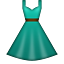
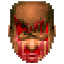
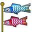
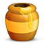
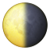
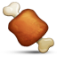
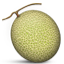
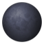
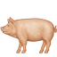
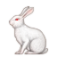

### gitmoji list
 - :art: `:art:` Improving structure format of the code.
 - :zap: `:zap:` Improving performance.
 - :fire: `:fire:` Removing code or files.
 - :bug: `:bug:` Fixing a bug.
 - :ambulance: `:ambulance:` Critical hotfix.
 - :sparkles: `:sparkles:` Introducing new features.
 - :memo: `:memo:` Writing docs.
 - :rocket: `:rocket:` Deploying stuff.
 - :lipstick: `:lipstick:` Updating the UI and style files.
 - :tada: `:tada:` Initial commit.
 - :white_check_mark: `:white_check_mark:` Adding tests.
 - :lock: `:lock:` Fixing security issues.
 - :apple: `:apple:` Fixing something on macOS.
 - :penguin: `:penguin:` Fixing something on Linux.
 - :checkered_flag: `:checkered_flag:` Fixing something on Windows.
 - :robot: `:robot:` Fixing something on Android.
 - :green_apple: `:green_apple:` Fixing something on iOS.
 - :bookmark: `:bookmark:` Releasing Version tags.
 - :rotating_light: `:rotating_light:` Removing linter warnings.
 - :construction: `:construction:` Work in progress.
 - :green_heart: `:green_heart:` Fixing CI Build.
 - :arrow_down: `:arrow_down:` Downgrading dependencies.
 - :arrow_up: `:arrow_up:` Upgrading dependencies.
 - :construction_worker: `:construction_worker:` Adding CI build system.
 - :chart_with_upwards_trend: `:chart_with_upwards_trend:` Adding analytics or tracking code.
 - :hammer: `:hammer:` Refactoring code.
 - :heavy_minus_sign: `:heavy_minus_sign:` Removing a dependency.
 - :whale: `:whale:` Work about Docker.
 - :heavy_plus_sign: `:heavy_plus_sign:` Adding a dependency.
 - :wrench: `:wrench:` Changing configuration files.
 - :globe_with_meridians: `:globe_with_meridians:` Internationalization and localization.
 - :pencil2: `:pencil2:` Fixing typos.
 - :hankey: `:hankey:` Writing bad code that needs to be improved.
 - :rewind: `:rewind:` Reverting changes.
 - :twisted_rightwards_arrows: `:twisted_rightwards_arrows:` Merging branches.
 - :package: `:package:` Updating compiled files or packages.
 - :alien: `:alien:` Updating code due to external API changes.
 - :truck: `:truck:` Moving or renaming files.
 - :page_facing_up: `:page_facing_up:` Adding or updating license.
 - :boom: `:boom:` Introducing breaking changes.
 - :bento: `:bento:` Adding or updating assets.
 - :ok_hand: `:ok_hand:` Updating code due to code review changes.
 - :wheelchair: `:wheelchair:` Improving accessibility.
 - :bulb: `:bulb:` Documenting source code.
 - :beers: `:beers:` Writing code drunkenly.
 - :speech_balloon: `:speech_balloon:` Updating text and literals.
 - :card_file_box: `:card_file_box:` Performing database related changes.
### gogs emoji list
### github emoji list
 -   `:1st_place_medal:`  `:2nd_place_medal:`  `:3rd_place_medal:`  `:afghanistan:`  `:aland_islands:`  `:albania:`  `:alembic:`
 -   `:american_samoa:`  `:amphora:`  `:andorra:`  `:angola:`  `:anguilla:`  `:antarctica:`  `:antigua_barbuda:`
 -   `:armenia:`  `:artificial_satellite:`  `:aruba:`  `:asterisk:`  `:athletic_shoe:`  `:atom:`  `:atom_symbol:`
 -   `:austria:`  `:avocado:`  `:azerbaijan:`  `:bacon:`  `:badminton:`  `:baguette_bread:`  `:bahamas:`
 -   `:balance_scale:`  `:ballot_box:`  `:bangladesh:`  `:barbados:`  `:basecamp:`  `:basecampy:`  `:basketball_man:`
 -   `:bat:`  `:beach_umbrella:`  `:bed:`  `:belarus:`  `:belgium:`  `:belize:`  `:bellhop_bell:`
 -   `:bermuda:`  `:bhutan:`  `:biking_man:`  `:biking_woman:`  `:biohazard:`  `:black_flag:`  `:black_heart:`
 -   `:blonde_man:`  `:blonde_woman:`  `:bolivia:`  `:bosnia_herzegovina:`  `:botswana:`  `:bow_and_arrow:`  `:bowing_man:`
 -   `:boxing_glove:`  `:brazil:`  `:british_indian_ocean_territory:`  `:british_virgin_islands:`  `:brunei:`  `:building_construction:`  `:bulgaria:`
 -   `:burrito:`  `:burundi:`  `:business_suit_levitating:`  `:butterfly:`  `:call_me_hand:`  `:cambodia:`  `:camera_flash:`
 -   `:camping:`  `:canada:`  `:canary_islands:`  `:candle:`  `:canoe:`  `:cape_verde:`  `:card_file_box:`
 -   `:caribbean_netherlands:`  `:carrot:`  `:cayman_islands:`  `:central_african_republic:`  `:chad:`  `:chains:`  `:champagne:`
 -   `:chile:`  `:chipmunk:`  `:christmas_island:`  `:cityscape:`  `:clamp:`  `:classical_building:`  `:clinking_glasses:`
 -   `:cloud_with_lightning_and_rain:`  `:cloud_with_rain:`  `:cloud_with_snow:`  `:clown_face:`  `:cocos_islands:`  `:coffin:`  `:colombia:`
 -   `:comoros:`  `:computer_mouse:`  `:congo_brazzaville:`  `:congo_kinshasa:`  `:construction_worker_man:`  `:construction_worker_woman:`  `:control_knobs:`
 -   `:costa_rica:`  `:cote_divoire:`  `:couch_and_lamp:`  `:couple_with_heart_man_man:`  `:couple_with_heart_woman_man:`  `:couple_with_heart_woman_woman:`  `:couplekiss_man_man:`
 -   `:couplekiss_woman_woman:`  `:cowboy_hat_face:`  `:crab:`  `:crayon:`  `:cricket:`  `:croatia:`  `:croissant:`
 -   `:crossed_swords:`  `:cuba:`  `:cucumber:`  `:curacao:`  `:cyprus:`  `:czech_republic:`  `:dagger:`
 -   `:dancing_women:`  `:dark_sunglasses:`  `:deer:`  `:denmark:`  `:derelict_house:`  `:desert:`  `:desert_island:`
 -   `:detective:`  `:djibouti:`  `:dominica:`  `:dominican_republic:`  `:dove:`  `:drooling_face:`  `:drum:`
 -   `:eagle:`  `:ecuador:`  `:egypt:`  `:el_salvador:`  `:electron:`  `:envelope_with_arrow:`  `:equatorial_guinea:`
 -   `:estonia:`  `:ethiopia:`  `:eu:`  `:european_union:`  `:eye:`  `:eye_speech_bubble:`  `:face_with_head_bandage:`
 -   `:falkland_islands:`  `:family_man_boy:`  `:family_man_boy_boy:`  `:family_man_girl:`  `:family_man_girl_boy:`  `:family_man_girl_girl:`  `:family_man_man_boy:`
 -   `:family_man_man_girl:`  `:family_man_man_girl_boy:`  `:family_man_man_girl_girl:`  `:family_man_woman_boy:`  `:family_man_woman_boy_boy:`  `:family_man_woman_girl:`  `:family_man_woman_girl_boy:`
 -   `:family_woman_boy:`  `:family_woman_boy_boy:`  `:family_woman_girl:`  `:family_woman_girl_boy:`  `:family_woman_girl_girl:`  `:family_woman_woman_boy:`  `:family_woman_woman_boy_boy:`
 -   `:family_woman_woman_girl_boy:`  `:family_woman_woman_girl_girl:`  `:faroe_islands:`  `:female_detective:`  `:ferry:`  `:field_hockey:`  `:fiji:`
 -   `:film_projector:`  `:film_strip:`  `:finland:`  `:fist_left:`  `:fist_oncoming:`  `:fist_raised:`  `:fist_right:`
 -   `:flight_arrival:`  `:flight_departure:`  `:flipper:`  `:fog:`  `:footprints:`  `:fountain_pen:`  `:fox_face:`
 -   `:french_guiana:`  `:french_polynesia:`  `:french_southern_territories:`  `:fried_egg:`  `:frowning_face:`  `:frowning_man:`  `:frowning_woman:`
 -   `:gabon:`  `:gambia:`  `:gear:`  `:georgia:`  `:ghana:`  `:gibraltar:`  `:goal_net:`
 -   `:golfing_woman:`  `:gorilla:`  `:greece:`  `:green_salad:`  `:greenland:`  `:grenada:`  `:guadeloupe:`
 -   `:guardswoman:`  `:guatemala:`  `:guernsey:`  `:guinea:`  `:guinea_bissau:`  `:guyana:`  `:haircut_man:`
 -   `:haiti:`  `:hammer_and_pick:`  `:hammer_and_wrench:`  `:handshake:`  `:heavy_heart_exclamation:`  `:hole:`  `:honduras:`
 -   `:hot_pepper:`  `:hotdog:`  `:houses:`  `:hugs:`  `:hungary:`  `:ice_hockey:`  `:ice_skate:`
 -   `:india:`  `:indonesia:`  `:iran:`  `:iraq:`  `:ireland:`  `:isle_of_man:`  `:israel:`
 -   `:jersey:`  `:jordan:`  `:joystick:`  `:kaaba:`  `:kazakhstan:`  `:kenya:`  `:keyboard:`
 -   `:kiribati:`  `:kiwi_fruit:`  `:knife:`  `:kosovo:`  `:kuwait:`  `:kyrgyzstan:`  `:label:`
 -   `:laos:`  `:latin_cross:`  `:latvia:`  `:lebanon:`  `:lesotho:`  `:level_slider:`  `:liberia:`
 -   `:liechtenstein:`  `:lion:`  `:lithuania:`  `:lizard:`  `:loud_sound:`  `:luxembourg:`  `:lying_face:`
 -   `:macedonia:`  `:madagascar:`  `:malawi:`  `:malaysia:`  `:maldives:`  `:male_detective:`  `:mali:`
 -   `:man_artist:`  `:man_astronaut:`  `:man_cartwheeling:`  `:man_cook:`  `:man_dancing:`  `:man_facepalming:`  `:man_factory_worker:`
 -   `:man_firefighter:`  `:man_health_worker:`  `:man_in_tuxedo:`  `:man_judge:`  `:man_juggling:`  `:man_mechanic:`  `:man_office_worker:`
 -   `:man_playing_handball:`  `:man_playing_water_polo:`  `:man_scientist:`  `:man_shrugging:`  `:man_singer:`  `:man_student:`  `:man_teacher:`
 -   `:mandarin:`  `:mantelpiece_clock:`  `:marshall_islands:`  `:martial_arts_uniform:`  `:martinique:`  `:massage_man:`  `:massage_woman:`
 -   `:mauritius:`  `:mayotte:`  `:medal_military:`  `:medal_sports:`  `:men_wrestling:`  `:menorah:`  `:mexico:`
 -   `:middle_finger:`  `:milk_glass:`  `:moldova:`  `:monaco:`  `:money_mouth_face:`  `:mongolia:`  `:montenegro:`
 -   `:moon:`  `:morocco:`  `:mosque:`  `:motor_boat:`  `:motor_scooter:`  `:motorcycle:`  `:motorway:`
 -   `:mountain_biking_man:`  `:mountain_biking_woman:`  `:mountain_snow:`  `:mozambique:`  `:mrs_claus:`  `:myanmar:`  `:namibia:`
 -   `:nauru:`  `:nauseated_face:`  `:nepal:`  `:nerd_face:`  `:netherlands:`  `:new_caledonia:`  `:new_zealand:`
 -   `:next_track_button:`  `:ng_man:`  `:ng_woman:`  `:nicaragua:`  `:niger:`  `:nigeria:`  `:night_with_stars:`
 -   `:no_good_man:`  `:no_good_woman:`  `:norfolk_island:`  `:north_korea:`  `:northern_mariana_islands:`  `:norway:`  `:oil_drum:`
 -   `:old_key:`  `:om:`  `:oman:`  `:open_book:`  `:open_umbrella:`  `:orange:`  `:orthodox_cross:`
 -   `:paintbrush:`  `:pakistan:`  `:palau:`  `:palestinian_territories:`  `:panama:`  `:pancakes:`  `:paperclips:`
 -   `:paraguay:`  `:parasol_on_ground:`  `:passenger_ship:`  `:pause_button:`  `:peace_symbol:`  `:peanuts:`  `:pen:`
 -   `:peru:`  `:philippines:`  `:pick:`  `:ping_pong:`  `:pitcairn_islands:`  `:place_of_worship:`  `:plate_with_cutlery:`
 -   `:poland:`  `:policeman:`  `:policewoman:`  `:popcorn:`  `:portugal:`  `:potato:`  `:pout:`
 -   `:pouting_woman:`  `:prayer_beads:`  `:pregnant_woman:`  `:previous_track_button:`  `:prince:`  `:printer:`  `:puerto_rico:`
 -   `:racing_car:`  `:radioactive:`  `:railway_track:`  `:rainbow_flag:`  `:raised_back_of_hand:`  `:raised_hand_with_fingers_splayed:`  `:raising_hand_man:`
 -   `:record_button:`  `:reminder_ribbon:`  `:rescue_worker_helmet:`  `:reunion:`  `:rhinoceros:`  `:right_anger_bubble:`  `:robot:`
 -   `:roll_eyes:`  `:romania:`  `:rosette:`  `:rowing_man:`  `:rowing_woman:`  `:running_man:`  `:running_woman:`
 -   `:samoa:`  `:san_marino:`  `:sao_tome_principe:`  `:saudi_arabia:`  `:scorpion:`  `:selfie:`  `:senegal:`
 -   `:seychelles:`  `:shallow_pan_of_food:`  `:shamrock:`  `:shark:`  `:shield:`  `:shinto_shrine:`  `:shopping:`
 -   `:shrimp:`  `:sierra_leone:`  `:singapore:`  `:sint_maarten:`  `:skier:`  `:skull_and_crossbones:`  `:sleeping_bed:`
 -   `:slightly_smiling_face:`  `:slovakia:`  `:slovenia:`  `:small_airplane:`  `:sneezing_face:`  `:snowman_with_snow:`  `:solomon_islands:`
 -   `:south_africa:`  `:south_georgia_south_sandwich_islands:`  `:south_sudan:`  `:speaking_head:`  `:spider:`  `:spider_web:`  `:spiral_calendar:`
 -   `:spoon:`  `:squid:`  `:sri_lanka:`  `:st_barthelemy:`  `:st_helena:`  `:st_kitts_nevis:`  `:st_lucia:`
 -   `:st_vincent_grenadines:`  `:stadium:`  `:star_and_crescent:`  `:star_of_david:`  `:stop_button:`  `:stop_sign:`  `:stopwatch:`
 -   `:stuffed_flatbread:`  `:sudan:`  `:sun_behind_large_cloud:`  `:sun_behind_rain_cloud:`  `:sun_behind_small_cloud:`  `:surfing_man:`  `:surfing_woman:`
 -   `:swaziland:`  `:sweden:`  `:swimming_man:`  `:swimming_woman:`  `:switzerland:`  `:synagogue:`  `:syria:`
 -   `:taiwan:`  `:tajikistan:`  `:tanzania:`  `:thailand:`  `:thermometer:`  `:thinking:`  `:tickets:`
 -   `:timor_leste:`  `:tipping_hand_man:`  `:tipping_hand_woman:`  `:togo:`  `:tokelau:`  `:tonga:`  `:tornado:`
 -   `:trackball:`  `:trinidad_tobago:`  `:tumbler_glass:`  `:tunisia:`  `:turkey:`  `:turkmenistan:`  `:turks_caicos_islands:`
 -   `:uganda:`  `:ukraine:`  `:unicorn:`  `:united_arab_emirates:`  `:upside_down_face:`  `:uruguay:`  `:us_virgin_islands:`
 -   `:vanuatu:`  `:vatican_city:`  `:venezuela:`  `:vietnam:`  `:volleyball:`  `:vulcan_salute:`  `:walking_man:`
 -   `:wallis_futuna:`  `:wastebasket:`  `:weight_lifting_man:`  `:weight_lifting_woman:`  `:western_sahara:`  `:wheel_of_dharma:`  `:white_flag:`
 -   `:wind_face:`  `:woman_artist:`  `:woman_astronaut:`  `:woman_cartwheeling:`  `:woman_cook:`  `:woman_facepalming:`  `:woman_factory_worker:`
 -   `:woman_firefighter:`  `:woman_health_worker:`  `:woman_judge:`  `:woman_juggling:`  `:woman_mechanic:`  `:woman_office_worker:`  `:woman_pilot:`
 -   `:woman_playing_water_polo:`  `:woman_scientist:`  `:woman_shrugging:`  `:woman_singer:`  `:woman_student:`  `:woman_teacher:`  `:woman_technologist:`
 -   `:women_wrestling:`  `:world_map:`  `:writing_hand:`  `:yemen:`  `:yin_yang:`  `:zambia:`  `:zimbabwe:`
### github & gogs emoji list
 -   `:+1:`  `:-1:`  `:100:`  `:1234:`  `:8ball:`  `:a:`  `:ab:`
 -   `:abcd:`  `:accept:`  `:aerial_tramway:`  `:airplane:`  `:alarm_clock:`  `:alien:`  `:ambulance:`
 -   `:angel:`  `:anger:`  `:angry:`  `:anguished:`  `:ant:`  `:apple:`  `:aquarius:`
 -   `:arrow_backward:`  `:arrow_double_down:`  `:arrow_double_up:`  `:arrow_down:`  `:arrow_down_small:`  `:arrow_forward:`  `:arrow_heading_down:`
 -   `:arrow_left:`  `:arrow_lower_left:`  `:arrow_lower_right:`  `:arrow_right:`  `:arrow_right_hook:`  `:arrow_up:`  `:arrow_up_down:`
 -   `:arrow_upper_left:`  `:arrow_upper_right:`  `:arrows_clockwise:`  `:arrows_counterclockwise:`  `:art:`  `:articulated_lorry:`  `:astonished:`
 -   `:b:`  `:baby:`  `:baby_bottle:`  `:baby_chick:`  `:baby_symbol:`  `:back:`  `:baggage_claim:`
 -   `:ballot_box_with_check:`  `:bamboo:`  `:banana:`  `:bangbang:`  `:bank:`  `:bar_chart:`  `:barber:`
 -   `:basketball:`  `:bath:`  `:bathtub:`  `:battery:`  `:bear:`  `:bee:`  `:beer:`
 -   `:beetle:`  `:beginner:`  `:bell:`  `:bento:`  `:bicyclist:`  `:bike:`  `:bikini:`
 -   `:birthday:`  `:black_circle:`  `:black_joker:`  `:black_medium_small_square:`  `:black_medium_square:`  `:black_nib:`  `:black_small_square:`
 -   `:blossom:`  `:blowfish:`  `:blue_book:`  `:blue_car:`  `:blue_heart:`  `:blush:`  `:boar:`
 -   `:bomb:`  `:book:`  `:bookmark:`  `:bookmark_tabs:`  `:books:`  `:boom:`  `:boot:`
 -   `:bow:`  `:bowling:`  `:bowtie:`  `:boy:`  `:bread:`  `:bride_with_veil:`  `:bridge_at_night:`
 -   `:broken_heart:`  `:bug:`  `:bulb:`  `:bullettrain_front:`  `:bullettrain_side:`  `:bus:`  `:busstop:`
 -   `:busts_in_silhouette:`  `:cactus:`  `:cake:`  `:calendar:`  `:calling:`  `:camel:`  `:camera:`
 -   `:candy:`  `:capital_abcd:`  `:capricorn:`  `:car:`  `:card_index:`  `:carousel_horse:`  `:cat:`
 -   `:cd:`  `:chart:`  `:chart_with_downwards_trend:`  `:chart_with_upwards_trend:`  `:checkered_flag:`  `:cherries:`  `:cherry_blossom:`
 -   `:chicken:`  `:children_crossing:`  `:chocolate_bar:`  `:christmas_tree:`  `:church:`  `:cinema:`  `:circus_tent:`
 -   `:city_sunset:`  `:cl:`  `:clap:`  `:clapper:`  `:clipboard:`  `:clock1:`  `:clock10:`
 -   `:clock11:`  `:clock1130:`  `:clock12:`  `:clock1230:`  `:clock130:`  `:clock2:`  `:clock230:`
 -   `:clock330:`  `:clock4:`  `:clock430:`  `:clock5:`  `:clock530:`  `:clock6:`  `:clock630:`
 -   `:clock730:`  `:clock8:`  `:clock830:`  `:clock9:`  `:clock930:`  `:closed_book:`  `:closed_lock_with_key:`
 -   `:cloud:`  `:clubs:`  `:cn:`  `:cocktail:`  `:coffee:`  `:cold_sweat:`  `:collision:`
 -   `:confetti_ball:`  `:confounded:`  `:confused:`  `:congratulations:`  `:construction:`  `:construction_worker:`  `:convenience_store:`
 -   `:cool:`  `:cop:`  `:copyright:`  `:corn:`  `:couple:`  `:couple_with_heart:`  `:cow:`
 -   `:credit_card:`  `:crescent_moon:`  `:crocodile:`  `:crossed_flags:`  `:crown:`  `:cry:`  `:crying_cat_face:`
 -   `:cupid:`  `:curly_loop:`  `:currency_exchange:`  `:curry:`  `:custard:`  `:customs:`  `:cyclone:`
 -   `:dancers:`  `:dango:`  `:dart:`  `:dash:`  `:date:`  `:de:`  `:deciduous_tree:`
 -   `:diamond_shape_with_a_dot_inside:`  `:diamonds:`  `:disappointed:`  `:disappointed_relieved:`  `:dizzy:`  `:dizzy_face:`  `:do_not_litter:`
 -   `:dog2:`  `:dollar:`  `:dolls:`  `:dolphin:`  `:door:`  `:doughnut:`  `:dragon:`
 -   `:dress:`  `:dromedary_camel:`  `:droplet:`  `:dvd:`  `:ear:`  `:ear_of_rice:`  `:earth_africa:`
 -   `:earth_asia:`  `:egg:`  `:eggplant:`  `:eight:`  `:eight_pointed_black_star:`  `:eight_spoked_asterisk:`  `:electric_plug:`
 -   `:email:`  `:e-mail:`  `:end:`  `:envelope:`  `:es:`  `:euro:`  `:european_castle:`
 -   `:evergreen_tree:`  `:exclamation:`  `:expressionless:`  `:eyeglasses:`  `:eyes:`  `:facepunch:`  `:factory:`
 -   `:family:`  `:fast_forward:`  `:fax:`  `:fearful:`  `:feelsgood:`  `:feet:`  `:ferris_wheel:`
 -   `:finnadie:`  `:fire:`  `:fire_engine:`  `:fireworks:`  `:first_quarter_moon:`  `:first_quarter_moon_with_face:`  `:fish:`
 -   `:fishing_pole_and_fish:`  `:fist:`  `:five:`  `:flags:`  `:flashlight:`  `:floppy_disk:`  `:flower_playing_cards:`
 -   `:foggy:`  `:football:`  `:fork_and_knife:`  `:fountain:`  `:four:`  `:four_leaf_clover:`  `:fr:`
 -   `:fried_shrimp:`  `:fries:`  `:frog:`  `:frowning:`  `:fu:`  `:fuelpump:`  `:full_moon:`
 -   `:game_die:`  `:gb:`  `:gem:`  `:gemini:`  `:ghost:`  `:gift:`  `:gift_heart:`
 -   `:globe_with_meridians:`  `:goat:`  `:goberserk:`  `:godmode:`  `:golf:`  `:grapes:`  `:green_apple:`
 -   `:green_heart:`  `:grey_exclamation:`  `:grey_question:`  `:grimacing:`  `:grin:`  `:grinning:`  `:guardsman:`
 -   `:gun:`  `:haircut:`  `:hamburger:`  `:hammer:`  `:hamster:`  `:hand:`  `:handbag:`
 -   `:hash:`  `:hatched_chick:`  `:hatching_chick:`  `:headphones:`  `:hear_no_evil:`  `:heart:`  `:heart_decoration:`
 -   `:heart_eyes_cat:`  `:heartbeat:`  `:heartpulse:`  `:hearts:`  `:heavy_check_mark:`  `:heavy_division_sign:`  `:heavy_dollar_sign:`
 -   `:heavy_minus_sign:`  `:heavy_multiplication_x:`  `:heavy_plus_sign:`  `:helicopter:`  `:herb:`  `:hibiscus:`  `:high_brightness:`
 -   `:hocho:`  `:honey_pot:`  `:honeybee:`  `:horse:`  `:horse_racing:`  `:hospital:`  `:hotel:`
 -   `:hourglass:`  `:hourglass_flowing_sand:`  `:house:`  `:house_with_garden:`  `:hurtrealbad:`  `:hushed:`  `:ice_cream:`
 -   `:id:`  `:ideograph_advantage:`  `:imp:`  `:inbox_tray:`  `:incoming_envelope:`  `:information_desk_person:`  `:information_source:`
 -   `:interrobang:`  `:iphone:`  `:it:`  `:izakaya_lantern:`  `:jack_o_lantern:`  `:japan:`  `:japanese_castle:`
 -   `:japanese_ogre:`  `:jeans:`  `:joy:`  `:joy_cat:`  `:jp:`  `:key:`  `:keycap_ten:`
 -   `:kiss:`  `:kissing:`  `:kissing_cat:`  `:kissing_closed_eyes:`  `:kissing_heart:`  `:kissing_smiling_eyes:`  `:koala:`
 -   `:kr:`  `:large_blue_circle:`  `:large_blue_diamond:`  `:large_orange_diamond:`  `:last_quarter_moon:`  `:last_quarter_moon_with_face:`  `:laughing:`
 -   `:ledger:`  `:left_luggage:`  `:left_right_arrow:`  `:leftwards_arrow_with_hook:`  `:lemon:`  `:leo:`  `:leopard:`
 -   `:light_rail:`  `:link:`  `:lips:`  `:lipstick:`  `:lock:`  `:lock_with_ink_pen:`  `:lollipop:`
 -   `:loudspeaker:`  `:love_hotel:`  `:love_letter:`  `:low_brightness:`  `:m:`  `:mag:`  `:mag_right:`
 -   `:mailbox:`  `:mailbox_closed:`  `:mailbox_with_mail:`  `:mailbox_with_no_mail:`  `:man:`  `:man_with_gua_pi_mao:`  `:man_with_turban:`
 -   `:maple_leaf:`  `:mask:`  `:massage:`  `:meat_on_bone:`  `:mega:`  `:melon:`  `:memo:`
 -   `:metal:`  `:metro:`  `:microphone:`  `:microscope:`  `:milky_way:`  `:minibus:`  `:minidisc:`
 -   `:money_with_wings:`  `:moneybag:`  `:monkey:`  `:monkey_face:`  `:monorail:`  `:mortar_board:`  `:mount_fuji:`
 -   `:mountain_cableway:`  `:mountain_railway:`  `:mouse:`  `:mouse2:`  `:movie_camera:`  `:moyai:`  `:muscle:`
 -   `:musical_keyboard:`  `:musical_note:`  `:musical_score:`  `:mute:`  `:nail_care:`  `:name_badge:`  `:neckbeard:`
 -   `:negative_squared_cross_mark:`  `:neutral_face:`  `:new:`  `:new_moon:`  `:new_moon_with_face:`  `:newspaper:`  `:ng:`
 -   `:no_bell:`  `:no_bicycles:`  `:no_entry:`  `:no_entry_sign:`  `:no_good:`  `:no_mobile_phones:`  `:no_mouth:`
 -   `:no_smoking:`  `:non-potable_water:`  `:nose:`  `:notebook:`  `:notebook_with_decorative_cover:`  `:notes:`  `:nut_and_bolt:`
 -   `:o2:`  `:ocean:`  `:octocat:`  `:octopus:`  `:oden:`  `:office:`  `:ok:`
 -   `:ok_woman:`  `:older_man:`  `:older_woman:`  `:on:`  `:oncoming_automobile:`  `:oncoming_bus:`  `:oncoming_police_car:`
 -   `:one:`  `:open_file_folder:`  `:open_hands:`  `:open_mouth:`  `:ophiuchus:`  `:orange_book:`  `:outbox_tray:`
 -   `:package:`  `:page_facing_up:`  `:page_with_curl:`  `:pager:`  `:palm_tree:`  `:panda_face:`  `:paperclip:`
 -   `:part_alternation_mark:`  `:partly_sunny:`  `:passport_control:`  `:paw_prints:`  `:peach:`  `:pear:`  `:pencil:`
 -   `:penguin:`  `:pensive:`  `:performing_arts:`  `:persevere:`  `:person_frowning:`  `:person_with_blond_hair:`  `:person_with_pouting_face:`
 -   `:pig:`  `:pig_nose:`  `:pig2:`  `:pill:`  `:pineapple:`  `:pisces:`  `:pizza:`
 -   `:point_left:`  `:point_right:`  `:point_up:`  `:point_up_2:`  `:police_car:`  `:poodle:`  `:poop:`
 -   `:postal_horn:`  `:postbox:`  `:potable_water:`  `:pouch:`  `:poultry_leg:`  `:pound:`  `:pouting_cat:`
 -   `:princess:`  `:punch:`  `:purple_heart:`  `:purse:`  `:pushpin:`  `:put_litter_in_its_place:`  `:question:`
 -   `:rabbit2:`  `:racehorse:`  `:radio:`  `:radio_button:`  `:rage:`  `:rage1:`  `:rage2:`
 -   `:rage4:`  `:railway_car:`  `:rainbow:`  `:raised_hand:`  `:raised_hands:`  `:raising_hand:`  `:ram:`
 -   `:rat:`  `:recycle:`  `:red_car:`  `:red_circle:`  `:registered:`  `:relaxed:`  `:relieved:`
 -   `:repeat_one:`  `:restroom:`  `:revolving_hearts:`  `:rewind:`  `:ribbon:`  `:rice:`  `:rice_ball:`
 -   `:rice_scene:`  `:ring:`  `:rocket:`  `:roller_coaster:`  `:rooster:`  `:rose:`  `:rotating_light:`
 -   `:rowboat:`  `:ru:`  `:rugby_football:`  `:runner:`  `:running:`  `:running_shirt_with_sash:`  `:sa:`
 -   `:sailboat:`  `:sake:`  `:sandal:`  `:santa:`  `:satellite:`  `:satisfied:`  `:saxophone:`
 -   `:school_satchel:`  `:scissors:`  `:scorpius:`  `:scream:`  `:scream_cat:`  `:scroll:`  `:seat:`
 -   `:see_no_evil:`  `:seedling:`  `:seven:`  `:shaved_ice:`  `:sheep:`  `:shell:`  `:ship:`
 -   `:shirt:`  `:shit:`  `:shoe:`  `:shower:`  `:signal_strength:`  `:six:`  `:six_pointed_star:`
 -   `:skull:`  `:sleeping:`  `:sleepy:`  `:slot_machine:`  `:small_blue_diamond:`  `:small_orange_diamond:`  `:small_red_triangle:`
 -   `:smile:`  `:smile_cat:`  `:smiley:`  `:smiley_cat:`  `:smiling_imp:`  `:smirk:`  `:smirk_cat:`
 -   `:snail:`  `:snake:`  `:snowboarder:`  `:snowflake:`  `:snowman:`  `:sob:`  `:soccer:`
 -   `:sos:`  `:sound:`  `:space_invader:`  `:spades:`  `:spaghetti:`  `:sparkle:`  `:sparkler:`
 -   `:sparkling_heart:`  `:speak_no_evil:`  `:speaker:`  `:speech_balloon:`  `:speedboat:`  `:squirrel:`  `:star:`
 -   `:stars:`  `:station:`  `:statue_of_liberty:`  `:steam_locomotive:`  `:stew:`  `:straight_ruler:`  `:strawberry:`
 -   `:stuck_out_tongue_closed_eyes:`  `:stuck_out_tongue_winking_eye:`  `:sun_with_face:`  `:sunflower:`  `:sunglasses:`  `:sunny:`  `:sunrise:`
 -   `:surfer:`  `:sushi:`  `:suspect:`  `:suspension_railway:`  `:sweat:`  `:sweat_drops:`  `:sweat_smile:`
 -   `:swimmer:`  `:symbols:`  `:syringe:`  `:tada:`  `:tanabata_tree:`  `:tangerine:`  `:taurus:`
 -   `:tea:`  `:telephone:`  `:telephone_receiver:`  `:telescope:`  `:tennis:`  `:tent:`  `:thought_balloon:`
 -   `:thumbsdown:`  `:thumbsup:`  `:ticket:`  `:tiger:`  `:tiger2:`  `:tired_face:`  `:tm:`
 -   `:tokyo_tower:`  `:tomato:`  `:tongue:`  `:top:`  `:tophat:`  `:tractor:`  `:traffic_light:`
 -   `:train2:`  `:tram:`  `:triangular_flag_on_post:`  `:triangular_ruler:`  `:trident:`  `:triumph:`  `:trolleybus:`
 -   `:trophy:`  `:tropical_drink:`  `:tropical_fish:`  `:truck:`  `:trumpet:`  `:tshirt:`  `:tulip:`
 -   `:tv:`  `:twisted_rightwards_arrows:`  `:two:`  `:two_hearts:`  `:two_men_holding_hands:`  `:two_women_holding_hands:`  `:u5272:`
 -   `:u55b6:`  `:u6307:`  `:u6708:`  `:u6709:`  `:u6e80:`  `:u7121:`  `:u7533:`
 -   `:u7a7a:`  `:uk:`  `:umbrella:`  `:unamused:`  `:underage:`  `:unlock:`  `:up:`
 -   `:v:`  `:vertical_traffic_light:`  `:vhs:`  `:vibration_mode:`  `:video_camera:`  `:video_game:`  `:violin:`
 -   `:volcano:`  `:vs:`  `:walking:`  `:waning_crescent_moon:`  `:waning_gibbous_moon:`  `:warning:`  `:watch:`
 -   `:watermelon:`  `:wave:`  `:wavy_dash:`  `:waxing_crescent_moon:`  `:waxing_gibbous_moon:`  `:wc:`  `:weary:`
 -   `:whale:`  `:whale2:`  `:wheelchair:`  `:white_check_mark:`  `:white_circle:`  `:white_flower:`  `:white_large_square:`
 -   `:white_medium_square:`  `:white_small_square:`  `:white_square_button:`  `:wind_chime:`  `:wine_glass:`  `:wink:`  `:wolf:`
 -   `:womans_clothes:`  `:womans_hat:`  `:womens:`  `:worried:`  `:wrench:`  `:x:`  `:yellow_heart:`
